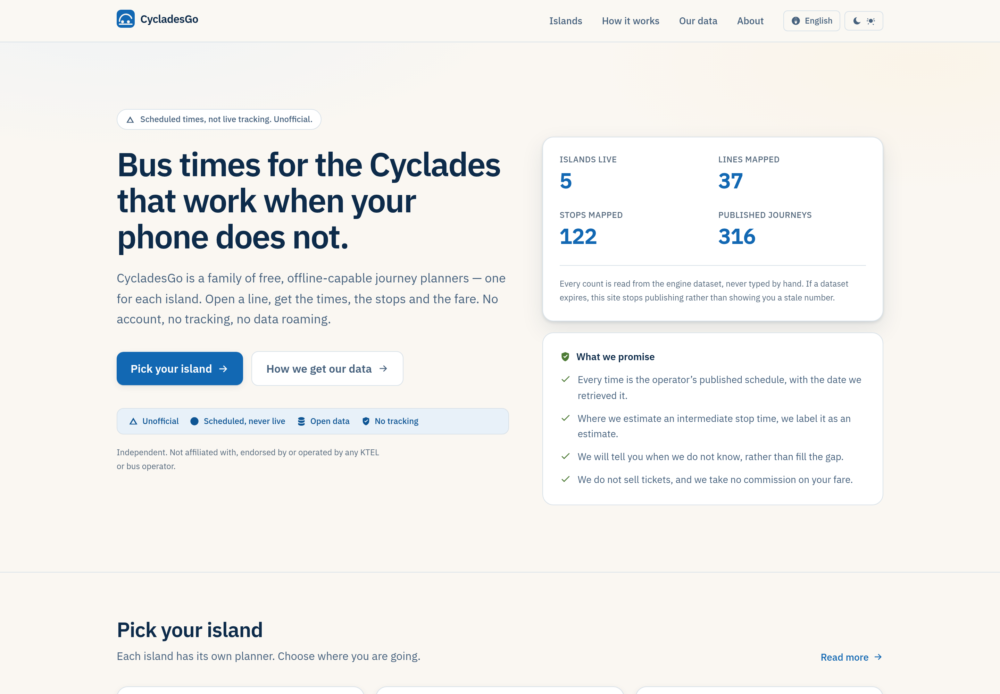
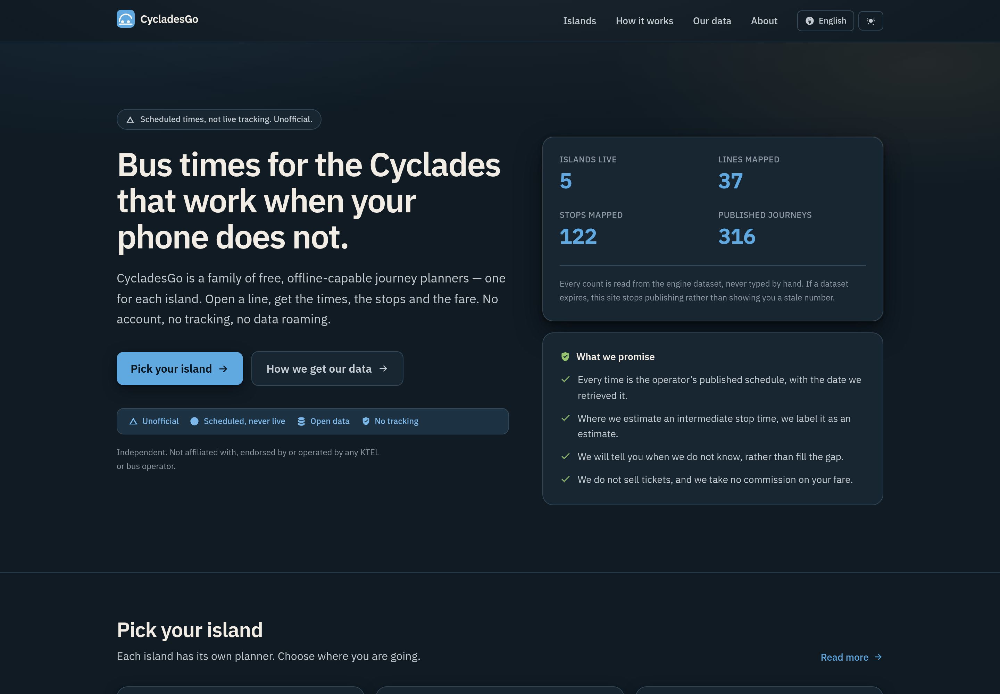
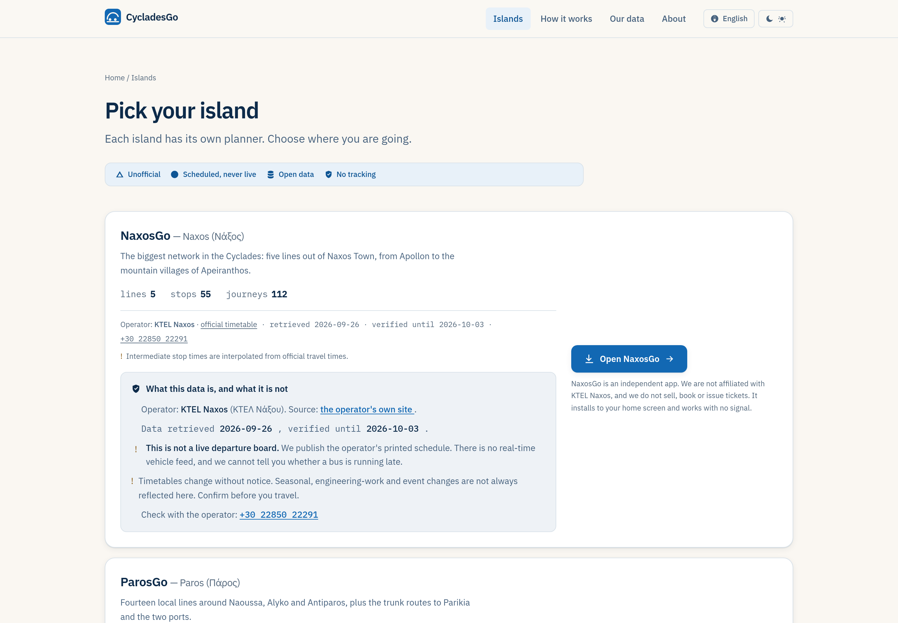
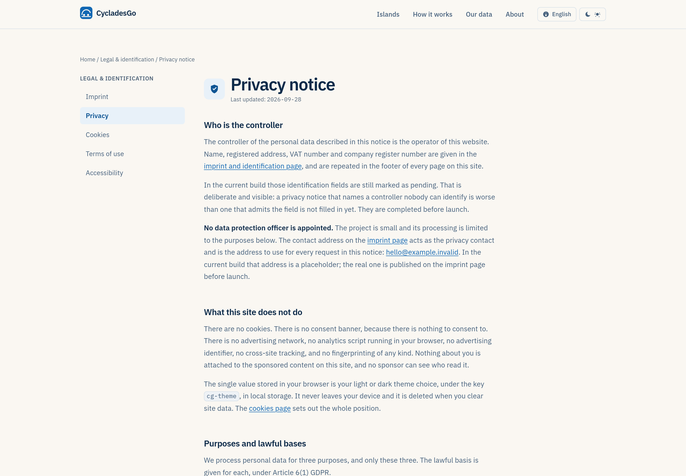

# CycladesGo

**Free, offline bus journey planners for the Greek Cyclades — one app per
island, plus this portal.**

CycladesGo is a small family of static web apps: a door-to-door journey planner
for each island, with the timetable baked into the build so it works at the
harbour with no signal. There is no account, no tracking, no ticket sales, and
no commission on your fare. English, Greek, German, French and Italian.

This repository is the **apex portal**: the marketing, SEO and content hub at
`cycladesgo.com`. It explains how island buses work, links to each planner, and
publishes where every number came from, when it was verified, and what we get
wrong.

## Relationship to the engine repo

The planners themselves live in a **separate repository**,
[`RM-bcn/Naxos-bus-pwa`](https://github.com/RM-bcn/Naxos-bus-pwa), which holds
the shared engine and one island pack per app. This repo never imports from it
and it never imports from here. What the two share is the design system
(the tokens are a verbatim port) and the conventions. The portal is a separate
deployable and stays that way.

Five planners exist today: Naxos, Paros, Santorini, Milos and Ios. Seven more
are listed as planned. A sixth island is added as a pack in the engine repo and
an entry in this repo's registry.

## What the design is

Warm, light and legible rather than clever. The light theme ("Cycladic Sun") is
sunlit plaster with warm neutrals and cool shadow edges; the dark theme
("Aegean Night v2") is desaturated blue-charcoal stone with a warm moonlit text
colour rather than a neutral one. Both carry the same three things: a fine
plaster grain over the whole page, a moonlight glow at the top in dark mode,
and semantic colour roles instead of decorative colour, so sea means water,
bougainvillea means sponsorship, olive means this is good news.

Typography is IBM Plex Sans for prose and IBM Plex Mono for anything numeric, so
times and counts line up in columns. Long-form pages are held to a 68-character
measure. Light and dark are both first-class and both are screenshotted.

The homepage leads with what we promise, not with a feature list: every time is
the operator's published schedule, interpolated stop times are labelled, and
there is no real-time feed. A stranger deciding whether to trust a bus timetable
from a stranger is the moment this site has to earn.

| | |
|---|---|
|  |  |
| Home, light and dark | |

| | |
|---|---|
|  |  |
| The island directory | The legal layout |

`docs/design/` holds 31 screenshots: 14 pages in light, the same 14 in dark, and
three mobile frames. Re-render them with `node scripts/shoot-design.mjs`.

## Quick start

```sh
npm install
npm run dev                      # http://localhost:4321/en/

ALLOW_UNRESOLVED_IMPRINT=1 npm run build   # publish gate + build + SEO audit
npm run check                    # astro check
```

`ALLOW_UNRESOLVED_IMPRINT=1` is a design-preview escape hatch only, because the
legal identity is deliberately unfilled. Never promote a build made with it.

## Documentation

| Document | What it is |
|---|---|
| [PLAN.md](PLAN.md) | The master plan: decisions, what is built, what is not, and in what order to build the rest |
| [AGENTS.md](AGENTS.md) | Operating manual for this repo: rules, commands, how to add a page, known gaps |
| [docs/seo.md](docs/seo.md) | The SEO/GEO operating manual that `scripts/audit-seo.ts` implements |
| [docs/legal.md](docs/legal.md) | The compliance record: imprint, non-affiliation, database rights, GDPR, accessibility, liability |
| [LICENSE](LICENSE) | MIT for the code |
| [NOTICE](NOTICE) | Third-party attributions and the data terms |

## Status

**Design prototype. Not deployed.**

There is no public URL. `cycladesgo.com` is intended but has not been
purchased, so the canonical, `robots.txt` and the subdomain plan still point at
a domain nobody controls. Eight things block a public launch, from
[PLAN.md §7](PLAN.md#p0--before-this-goes-on-a-public-url):

1. Buy `cycladesgo.com` (and `.gr` defensively); decide apex vs `www`.
2. Fill the imprint: legal name, registered address, e-mail, VAT, GEMI.
3. Name a human maintainer. The `/about` page and the `Person` graph node are
   placeholders.
4. Answer the six open legal questions in `PLAN.md` §6.
5. Decide analytics: server-side only, or a real consent banner. The cookies
   page and a banner ship together, or neither does.
6. Add the fail-closed scraping rule to the engine repo's `AGENTS.md` and its CI.
7. Set up Search Console and Bing Webmaster per host, plus an IndexNow
   `postbuild` hook.
8. Operationalise the operator-relationship e-mail: source URLs, rate limits, a
   named contact, a correction channel.

Also unfinished, and visible in the repo rather than hidden: the island registry
is hand-maintained (`npm run islands:sync` is declared but not implemented),
long-form content is English-only, analytics are not wired, the donation
mechanism is specified on `/sponsors` but not built, and no external
accessibility audit or EUTM clearance has been done.

## Licence

Code: MIT, see [LICENSE](LICENSE). Data: the curation is CC-BY 4.0 and the parts
derived from OpenStreetMap carry the ODbL 1.0 share-alike obligation, see
[NOTICE](NOTICE) and `/en/data/open-data`. The dataset terms in the engine repo
(`LICENSE-DATA`) apply to the engine's data files, not to this site's code.

CycladesGo is not affiliated with, endorsed by, authorised by or operated by any
KTEL or bus operator, and it is not a ticket sales office. Departure times are
operators' published schedules; there is no real-time feed.
